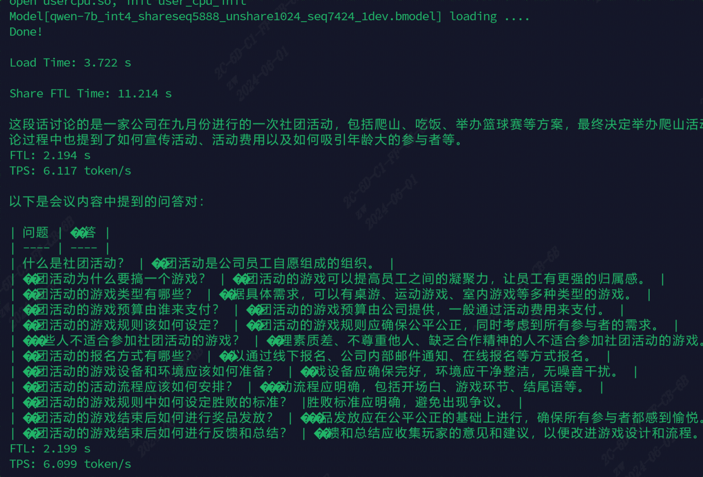

# Command
your_torch_model是你模型的路径
```shell
pip install transformers_stream_generator einops tiktoken accelerate transformers==4.32.0

cp files/Qwen-7B-Chat/* your_torch_model

./compile.sh --mode int4 --name qwen-7b --share_length 6016 --addr_mode io_alone --unshare_length 1536 --dynamic 1
```

# 直接下载
如果你不想编译模型，也可以直接下载
```shell
pip3 install dfss
python3 -m dfss --url=open@sophgo.com:/ext_model_information/LLM/LLM-TPU/qwen-7b_int4_shareseq6016_unshare1536_seq7552_1dev_dyn.bmodel
```
* 使用的TPU-MLIR版本： bacc66292743153ff2f16927bffee69ffacb476c
* 内存：9663MB（动态）

# 分片方式
|第一片                  |第二片                 |第三片              |
|:-                     |:-                     |:-                 |
|share                  |unshare                |decode             |
|share_length=6016      |unshare_length=1536    |decode_length=0    |

# 编译库文件
```shell
mkdir build
cd build && cmake .. && make && cp *cpython* .. && cd ..
```

# python demo
```shell
python3 pipeline.py --model_path qwen-7b_int4_shareseq6016_unshare1536_seq7552_1dev.bmodel --tokenizer_path ../support/token_config/ --devid 0 --generation_mode penalty_sample
```

# 效果图



# 如何导出logits
如果您想查看每层输出的logits，您可以按照如下步骤来导出

## 1. clone cnpy库
```
mkdir third_party
cd third_party && git clone https://github.com/rogersce/cnpy.git
```

## 2. 修改CMakeLists.txt 
将CMakeLists.txt替换为以下内容
```makefile
cmake_minimum_required(VERSION 3.10)
project(codefuse)

if (NOT DEFINED TARGET_ARCH)
    set(TARGET_ARCH pcie)
endif()

include_directories(${PROJECT_SOURCE_DIR}/../../../support/include)
include_directories(${PROJECT_SOURCE_DIR}/third_party/cnpy)

if (${CMAKE_HOST_SYSTEM_PROCESSOR} STREQUAL "aarch64")
    add_definitions(-DSOC_TARGET)
    link_directories(${PROJECT_SOURCE_DIR}/../../../support/lib_soc)
    message("SoC mode, starting......")
elseif (${TARGET_ARCH} STREQUAL "pcie")
    add_definitions(-DPCIE_TARGET)
    link_directories(${PROJECT_SOURCE_DIR}/../../../support/lib_pcie)
    message("PCIE mode, starting......")
endif()

# add_definitions(-DDEBUG --std=c++17 -fPIC -Wall -Werror)
add_definitions(-DDEBUG --std=c++17 -fPIC -Wall -lcnpy)
set(CMAKE_BUILD_TYPE "Debug")
add_subdirectory(third_party/cnpy)

find_package(pybind11 REQUIRED CONFIG)

file(GLOB CPP_FILES ${PROJECT_SOURCE_DIR}/*.cpp)

foreach(CPP_FILE ${CPP_FILES})
    get_filename_component(MODULE_NAME ${CPP_FILE} NAME_WE)
    pybind11_add_module(${MODULE_NAME} ${CPP_FILE})
    target_link_libraries(${MODULE_NAME} PUBLIC bmrt bmlib cnpy)
    install(TARGETS ${MODULE_NAME} DESTINATION python)
endforeach()
```

### 3. 修改chat_debug.cpp文件
根据你需要查看的logits来写正确的代码，可以参考以下代码（位于chat_debug.cpp:397行）
```cpp
dump_tensor_to_file<uint16_t>(bm_handle,net_blocks[idx]->stages[0].output_mems[0],{1,6016,4096},"output_" + std::to_string(idx) + ".npz","hidden_states");
dump_tensor_to_file<int32_t>(bm_handle,net_blocks[idx]->stages[0].output_mems[1],{1,6016},"output_" + std::to_string(idx) + ".npz","present_key");
dump_tensor_to_file<uint16_t>(bm_handle,net_blocks[idx]->stages[0].output_mems[2],{1,1,6016,6016},"output_" + std::to_string(idx) + ".npz","present_value");
```
注意
* shape一定要设置正确，可以通过model_tool --info xxx.bmodel来查看shape
* 如果compile.sh转的是bf16类型，那么dump_tensor_to_file需要使用bf16_to_fp32_value；compile.sh转的是fp16类型，那么dump_tensor_to_file需要使用fp16_ieee_to_fp32_value

### 4. 导出npz文件
运行以下命令
```shell
rm *.npz
python3 pipeline.py --model_path qwen-7b_int4_shareseq6016_1dev_dyn.bmodel --tokenizer_path ../support/token_config/ --devid 0 --generation_mode penalty_sample --mode debug
```

* 如果之前目录下有output_x.npz文件，记得提前删掉，不然会有问题
* 开启--mode debug模式来导出

### 5. 如何使用
```python
import numpy as np
x = np.load("output_0.npz")
print(x.files)
print(x["hidden_states"])
```


